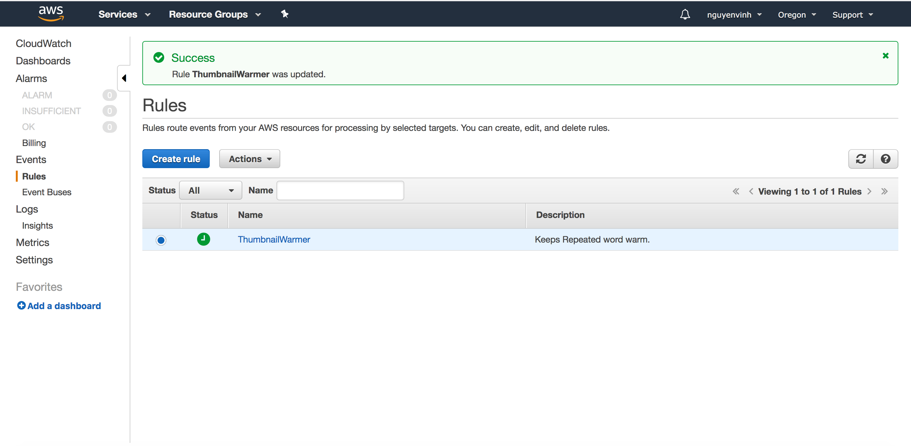
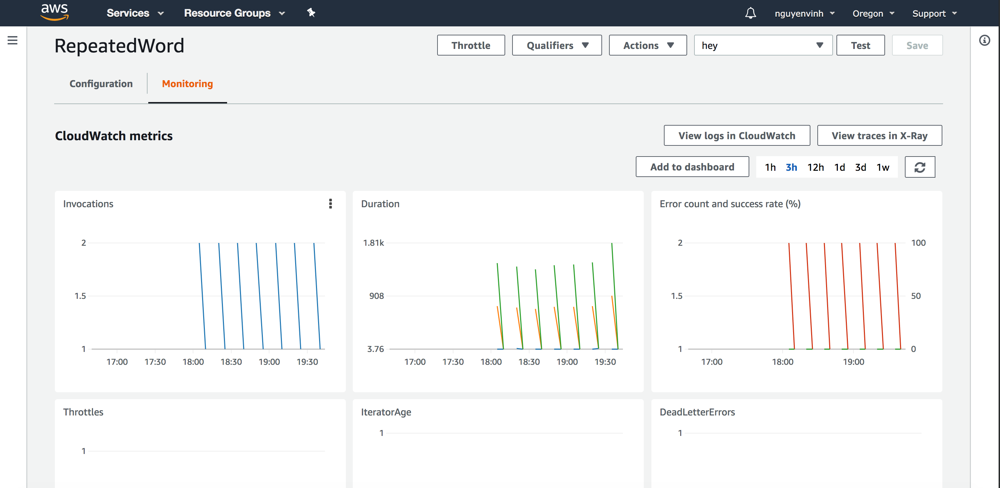

# cloudwatch lambda warmer

## Implementation

Used Cloudwatch to set up scheduled lambda warmer to Repeated Word API gateway every fifteen minutes

Link to API: https://jxu6h4c7vc.execute-api.us-west-2.amazonaws.com/init?sentence=Your%20Input%20Here

Proof of Lambda Warmer working:

